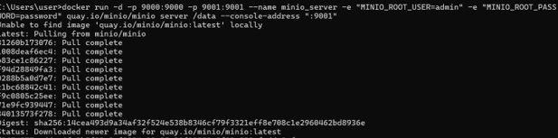

## 1. File Storage

File storage is the most familiar method of data management. In this method, data is organized in a hierarchical structure of folders and subfolders.
A file is accessed using a path that indicates its location in the folder structure. The system manages a Metadata layer that links the file name to the physical location where it is saved.

## Advantages:

Intuitive structure that is easy for users to understand and manage.
Allows direct editing of files.
Suitable for sharing files between users.

## Disadvantages:

Limits scalability when the number of files increases greatly
Metadata management and the hierarchical structure may become a performance bottleneck.
Less suitable for very large cloud systems and distributed environments.

## Block storage

In this method, the storage system treats the disk as small, fixed data units called blocks. The storage itself is unaware of the file structure.
The system allows reading and writing of blocks according to the memory address. The operating system or file system on top of the storage is the one that assembles entire files from the blocks.

## Advantages:

Very high performance and low response time.
Particularly suitable for running databases and operating systems.
Allows fast access to read and write data.

## Disadvantages:

More complex to manage and maintain in distributed environments.
Relatively high cost compared to other solutions.
The storage system itself does not provide rich metadata for advanced data management.

## Object Storage

Object Storage is based on a flat structure without a folder hierarchy. Each unit of information is stored as an independent object.
Each object includes three main components:
The data itself (Data)
A unique identifier (Key / ID)
Additional descriptive information (Metadata)
Objects are usually accessed via an HTTP-based API, which is why this method is particularly suitable for cloud environments.

## Advantages:

Very high scalability that allows for the storage of huge amounts of data.
Support for rich and customized metadata for advanced information management and search.
Especially suitable for Cloud-Native systems and distributed services.

## Disadvantages:

It is usually not possible to partially edit an object; a change requires re-uploading the entire object.
Less suitable for applications that require small and frequent updates.
Higher access time compared to Block Storage for applications that require extreme performance.

## 2.

S3 (Simple Storage Service) Definition
S3 is an object storage system used to store and retrieve data in a highly scalable and reliable way. In S3, data is stored as objects, which include the file itself, customizable metadata, and a unique identifier (Key).
The storage structure in S3 is based on a flat hierarchy using buckets and objects. A bucket acts as a top-level container that holds objects, while each object represents a stored file. Unlike traditional filesystems, there are no real "folders"; instead, S3 uses prefixes in object names to simulate a directory structure.
S3 is designed to handle virtually unlimited amounts of data and is commonly used for storing application files, backups, logs, and other types of unstructured data. It allows access from anywhere via standard HTTP/S APIs, web interfaces, or command-line tools, making it a core component of cloud-native architectures.

## 3.

A Bucket is the fundamental, top-level logical container for data stored in an S3-compatible system. It functions as a primary "vault" or drive where all objects and their metadata are kept, and every file uploaded must be associated with a specific bucket. Unlike traditional filesystems that rely on a nested hierarchy of folders, a bucket manages data in a completely flat structure. This design is what allows the system to store an unlimited number of objects while maintaining high performance and scalability, as it avoids the overhead of navigating complex directory trees.
Beyond its role as a container, a bucket serves as the essential unit of management and configuration. At the bucket level, developers define the "rules of the game," such as access permissions , versioning policies (keeping a history of file changes), and the physical geographic region where the data is stored. While names must be globally unique in public cloud environments  . Ultimately, the bucket is the core organizational component of S3 storage, enabling it to handle massive amounts of data in a flexible and cost-effective manner.

## 4.

Technically, the concept of "folders" or "directories" does not exist in S3.  S3 uses a completely flat storage structure. Every object is stored directly within a bucket at the same logical level, and there is no real nested hierarchy.
However, S3 simulates a folder-like organization through the use of Key Prefixes and delimiters . When an object is named with a prefix, such as images/vacation/photo.jpg, the management console parses the name and displays it as if the file is inside folders. In reality, the "folder path" is simply part of the object's unique name (the Key). This design is a critical engineering choice: because the system remains flat, it does not need to traverse a complex directory tree to locate a file. This ensures nearly instantaneous retrieval times and massive scalability, even when managing billions of objects, a feat that traditional hierarchical filesystems cannot achieve as they grow.

## 5.

S3 imposes limits on the size of individual objects while allowing virtually unlimited total storage. A single object can range from 0 bytes up to 5 terabytes (5 TB). Large files can be uploaded efficiently using a multipart upload process, which splits the file into smaller parts and uploads them separately.
In contrast to classic filesystems, S3 is designed to scale horizontally and is not limited by the capacity of a single physical disk. Traditional filesystems depend on the storage capacity of the hardware they run on, whereas S3 can store an extremely large number of objects without practical limits. Additionally, while classic filesystems rely on hierarchical directory structures, S3 uses a flat structure based on objects and buckets, which enables better scalability for large-scale storage systems.

## 6.

Since Amazon S3 is the most widely used cloud storage service in the world, its API has become the industry-standard protocol for object storage. This has led to the development of several S3-compatible implementations that allow developers to use the same "language" and tools across different environments. The most prominent implementation is MinIO, an open-source, high-performance server that provides a local version of S3. While Amazon S3 is the primary choice for public cloud storage, MinIO is the leading choice for local development and private clouds, as it can be easily deployed via Docker to provide a free, fast, and isolated testing environment. Other notable implementations include Ceph Object Gateway, which allows enterprises to run S3-compatible storage on their own physical servers, and LocalStack, which is used in QA and automation to mock an entire AWS environment locally. By using these diverse implementations, developers can write code once and seamlessly switch between a local MinIO instance for testing and the actual Amazon S3 cloud for production.

## 7.
